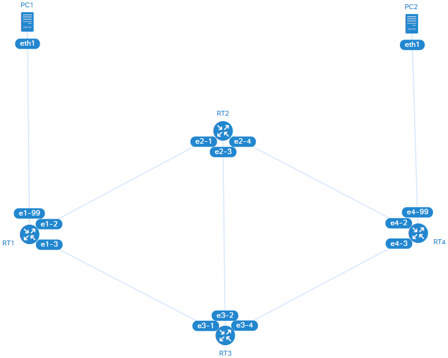

# 🔀 OSPF

## 🧪 実験環境

||
|:-:|
|トポロジー図|

|ネットワーク|概要|
|:-|:-|
|`10.0.1.0/24`|`PC1` - `R1`|
|`10.0.2.0/24`|バックボーン|
|`10.0.3.0/24`|`R4` - `PC2`|

|ノード|I/F|IPv4 アドレス|MAC アドレス|
|:-|:-|:-|:-|
|`PC1`|`eth1`|`10.0.1.1/24`|`0a:00:00:00:00:01`|
|`RT1`|`e1-99`|`10.0.1.254/24`|`0a:00:01:00:01:99`|
|`RT1`|`e1-2`|`10.0.2.12/24`|`0a:00:01:00:01:02`|
|`RT1`|`e1-3`|`10.0.2.13/24`|`0a:00:01:00:01:03`|
|`RT2`|`e2-1`|`10.0.2.21/24`|`0a:00:02:00:02:01`|
|`RT2`|`e2-3`|`10.0.2.23/24`|`0a:00:02:00:02:03`|
|`RT2`|`e2-4`|`10.0.2.24/24`|`0a:00:02:00:02:04`|
|`RT3`|`e3-1`|`10.0.2.31/24`|`0a:00:03:00:03:01`|
|`RT3`|`e3-2`|`10.0.2.32/24`|`0a:00:03:00:03:02`|
|`RT3`|`e3-4`|`10.0.2.34/24`|`0a:00:03:00:03:04`|
|`RT4`|`e4-2`|`10.0.2.42/24`|`0a:00:04:00:04:02`|
|`RT4`|`e4-3`|`10.0.2.43/24`|`0a:00:04:00:04:03`|
|`RT4`|`e4-99`|`10.0.3.254/24`|`0a:00:04:00:04:99`|
|`PC2`|`eth1`|`10.0.3.1/24`|`0a:00:05:00:00:01`|

実験環境の構築:

```bash
containerlab deploy --reconfigure
```

## ✅ 動作確認

### 経路の切り替わり

|順序|実行端末|コマンド|概要|
|:-:|:-|:-|:-|
|1|ホスト|`docker exec -it clab-ospf-routing-PC1 bash`|`PC1` に入る|
|2|`PC1:/#`|`mtr 10.0.3.1`|`10.0.3.1` への経路を監視する|
|3|ホスト|`docker exec -it clab-ospf-routing-RT1 bash`|`RT1` に入る|
|4|`RT1:/#`|`vtysh`|FRR のルーティングデーモンをシェルで操作する|
|5|`RT1#`|`configure terminal`|動作設定を変更をするモードに入る|
|6|`RT1(config)#`|`interface e1-3`|`e1-3` インタフェースの設定をする|
|7|`RT1(config-if)#`|`shutdown`|インタフェースの無効化|
|8|`RT1(config-if)#`|`no shutdown`|インタフェースの有効化|

- 元の経路は `PC1` → `RT1` → `RT3` → `RT4` → `PC2`
- 7番目のコマンド (`shutdown`) を実行すると、経路がすぐに切り替わる (`PC1` → `RT1` → `RT2` → `RT3` → `RT4` → `PC2`)
- 8番目のコマンド (`no shutdown`) を実行しても、元の経路にすぐには戻らない
  - 何が起こっている？

### メトリック値の設定はメリハリをつける

- 同一設備内のリンク
  - 2桁
- 国内の拠点間のリンク
  - 3桁
- 国際間のリンク
  - 4桁

### セキュリティーと認証

- passive-interface
- 認証キー

### OSPF パケットタイプ

|パケットタイプ|名称|役割|
|:-:|:-|:-|
|1|Hello|隣接する OSPF ルーターを発見したり、隣接関係を維持したりする|
|2|DBD (Database Description)|接続情報の差分を確認する|
|3|LSR (Link State Request)|接続情報を要求する|
|4|LSU (Link State Update)|接続情報を通知する|
|5|LSAck (Link State Acknowledgement)|確認応答する|

|LSA タイプ|名称|役割|
|:-:|:-|:-|
|1|Router LSA|各 OSPF ルーターが生成する。<br>自身が接続している、ルーターやネットワークの情報。|
|2|Network LSA|代表ルーターが生成する。<br>ネットワークと接続しているルーターの情報。|
|3|Network Summary LSA|エリア間の境界ルーターが生成する。<br>エリア間のネットワークの情報。|
|4|ASBR Summary LSA|エリア間の境界ルーターが生成する。<br>OSPF 外部のネットワークの情報。|
|5|AS external LSA|OSPF 外部との境界ルーターが生成する。<br>OSPF 外部のネットワークの情報。|
