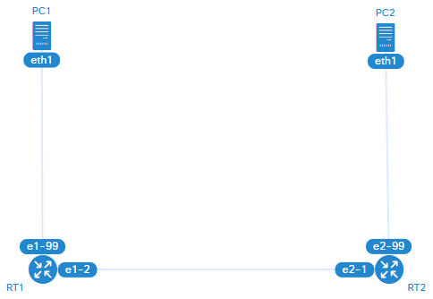

# ➡️ 静的経路制御

## 🧪 実験環境

||
|:-:|
|トポロジー図|

|ネットワーク|概要|
|:-|:-|
|`10.0.1.0/24`|`PC1` - `R1`|
|`10.0.2.0/30`|`R1` - `R2`|
|`10.0.3.0/24`|`R2` - `PC2`|

|ノード|I/F|IPv4 アドレス|MAC アドレス|
|:-|:-|:-|:-|
|`PC1`|`eth1`|`10.0.1.1/24`|`0a:00:00:00:00:01`|
|`R1`|`e1-1`|`10.0.1.254/24`|`0a:00:01:00:01:01`|
|`R1`|`e2-1`|`10.0.2.1/30`|`0a:00:01:00:02:01`|
|`R2`|`e2-1`|`10.0.2.2/30`|`0a:00:02:00:02:01`|
|`R2`|`e1-1`|`10.0.3.254/24`|`0a:00:02:00:01:01`|
|`PC2`|`eth1`|`10.0.3.1/24`|`0a:00:03:00:00:01`|

実験環境の構築:

```bash
containerlab deploy --reconfigure
```

## ✅ 動作確認

### PC1 から PC2 にパケットを送る

```bash
docker exec -it clab-static-routing-PC1 bash
```

```bash
ping 10.0.3.1
```

```bash
traceroute 10.0.3.1
```

```bash
mtr 10.0.3.1
```
